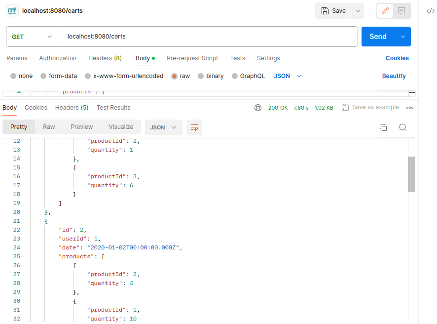

# Cart Service API Documentation

## Setup Instructions

1. Clone the repository from GitHub.
2. Open the project in IntelliJ IDEA 2023.3.4 or any other IDE that supports Java and Maven.
3. Ensure that you have Java and Maven installed on your Linux machine. If you use Windows Follow [this](https://itsfoss.com/install-windows-after-ubuntu-dual-boot/) guide to install Linux on your System. Don't use Windows its bad!
4. Build the project using Maven. In the terminal, navigate to the project directory and run the command `mvn clean install`.
5. Run the application. In IntelliJ, you can do this by clicking on the 'Run' button.

## API Endpoints

### 1. Get Service Status

- Endpoint: `GET /carts/status`
- Description: Checks if the Cart Service is up and running.
- Response: A string message indicating the status of the service.
- 

### 2. Get All Carts

- Endpoint: `GET /carts`
- Description: Retrieves all carts.
- Response: A list of all carts.
- 

### 3. Get Cart by ID

- Endpoint: `GET /carts/cart/{id}`
- Description: Retrieves a specific cart by its ID.
- Parameters: `id` (path parameter) - The ID of the cart.
- Response: The cart with the specified ID.
- 

### 4. Get Carts by User ID

- Endpoint: `GET /carts/user/{userId}`
- Description: Retrieves all carts for a specific user.
- Parameters: `userId` (path parameter) - The ID of the user.
- Response: A list of all carts for the specified user.
- 

### 5. Get Carts in Date Range

- Endpoint: `GET /carts`
- Description: Retrieves all carts within a specified date range.
- Parameters: `startDate` (query parameter) - The start date of the range, `endDate` (query parameter) - The end date of the range.
- Response: A list of all carts within the specified date range.
- 

### 6. Add a Cart-

- Endpoint: `POST /carts`
- Description: Adds a new cart.
- Request Body: A JSON object representing the new cart.
- Response: The added cart.
- 

### 7. Update a Cart

- Endpoint: `PUT /carts/cart/{id}`
- Description: Updates a specific cart.
- Parameters: `id` (path parameter) - The ID of the cart.
- Request Body: A JSON object representing the updated cart.
- Response: A string message indicating the update status.

### 8. Delete a Cart

- Endpoint: `DELETE /carts/cart/{id}`
- Description: Deletes a specific cart.
- Parameters: `id` (path parameter) - The ID of the cart.
- Response: A string message indicating the deletion status.
